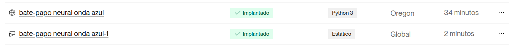
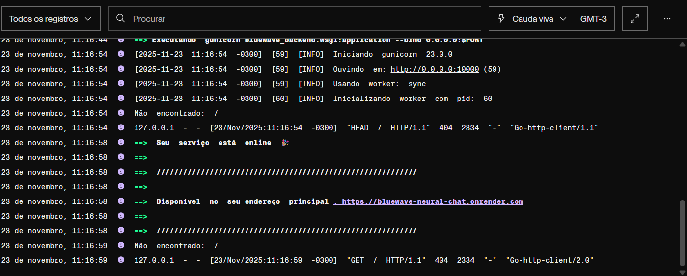
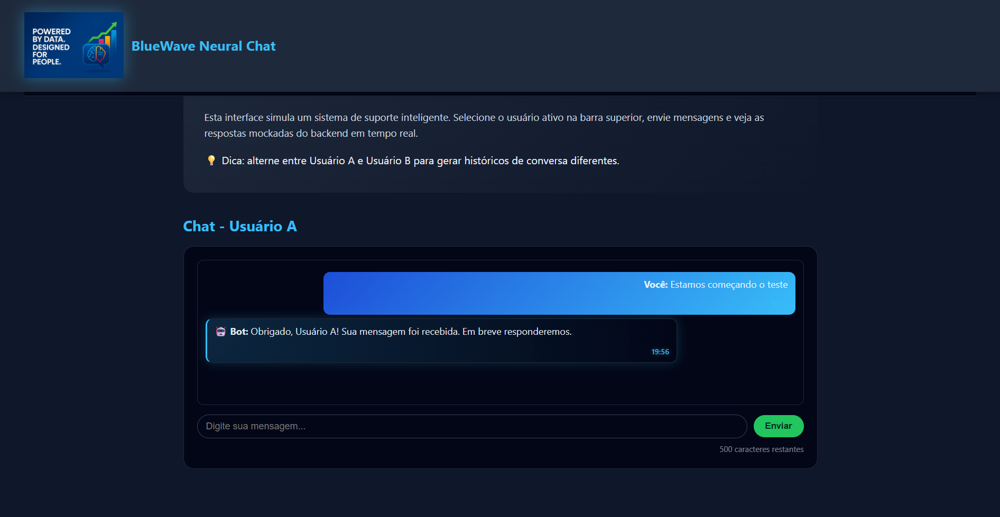
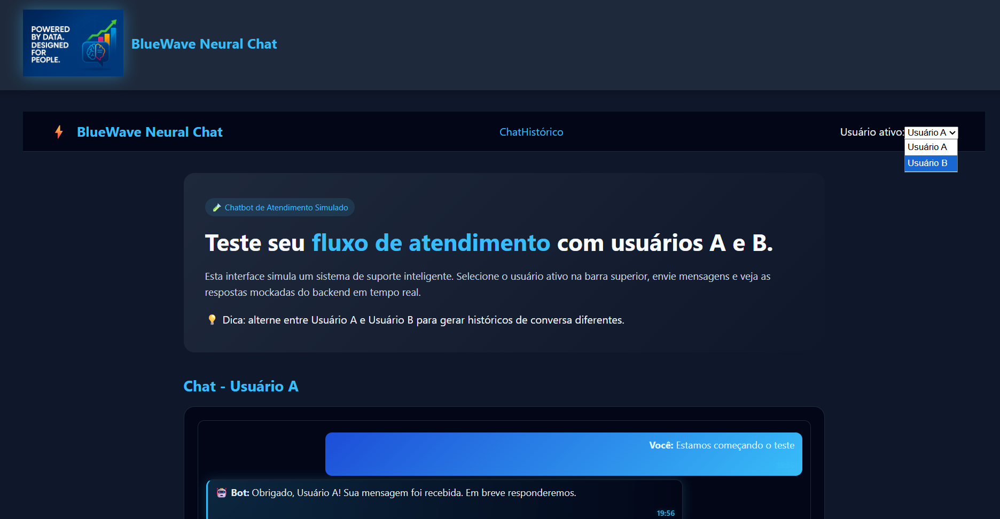
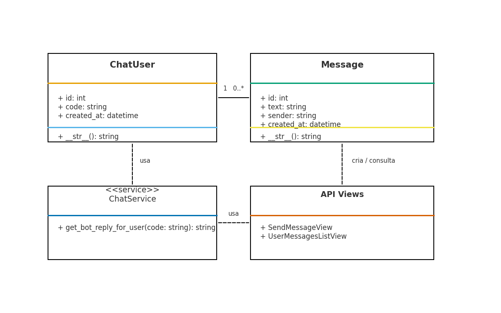
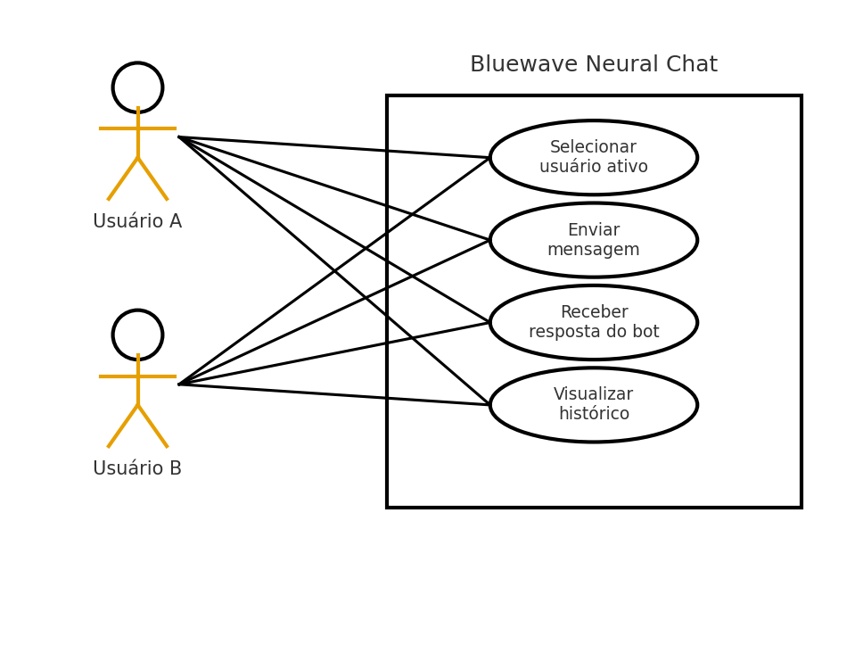

## 🌊 BlueWave Neural Chat

Django REST Framework • React • Docker • Python • JavaScript • CSS

  

## 🚀 Descrição do Projeto

O BlueWave Neural Chat é um sistema fullstack desenvolvido para simular um fluxo real de atendimento via chatbot.
O projeto foi construído como prova de domínio em:

Arquitetura fullstack moderna

Django REST Framework

React + Vite

Docker e containerização

Organização, boas práticas e código limpo

UI moderna e responsiva (tema Dark-Tech)

O sistema permite:

💬 Enviar mensagens e receber respostas mockadas

👥 Alternar entre Usuário A e B

🗂 Visualizar histórico individual de cada usuário

⚛️ Aplicação SPA moderna com Context API

🐳 Execução fullstack via Docker Compose

## 🌐 Versão Online (Render)

O BlueWave Neural Chat também está implantado e funcionando em ambiente real no Render, simulando um cenário de produção completo.

### 🔗 Endpoints do Deploy

- 🌍 **Backend (API Django + DRF)**  
  https://bluewave-neural-chat.onrender.com

- 💻 **Frontend (SPA React)**  
  https://bluewave-neural-chat-1.onrender.com

> O frontend consome a API hospedada no backend acima.  
> O deploy foi configurado com migrations, Start Command customizado e build automatizado do Render.

## 📸 Deploy no Render (prints)

### ⚙️ Processo de implantação no Render

### ✔ Serviço online após migrações

## 🎯 Objetivo da Implantação no Render

A implantação deste projeto no Render foi realizada com o propósito de demonstrar domínio completo sobre:

- **Deploy real de aplicações fullstack**
- **Configuração de ambientes em produção**
- **Execução de migrations em cenários sem acesso ao shell**
- **Ajustes necessários para rodar Django + DRF em servidores serverless**
- **Integração entre SPA React e API Django em ambiente remoto**

Embora o projeto também rode 100% local via Docker ou manualmente,
o deploy no Render serve como **validação prática** de que toda a arquitetura funciona em:

- Ambiente Linux remoto  
- Build automático via GitHub  
- Instância web com Start Command configurado  
- Banco SQLite gerenciado pelo serviço  
- Fluxo CI/CD simplificado (push → build → deploy)

### 🔍 Por que usar o Render?

O Render foi escolhido por três motivos principais:

1. **Ambiente gratuito**, ideal para provas técnicas e demonstrações.
2. **Pipeline automatizado**, que permite validar se o projeto está pronto para produção.
3. **Ambiente real**, que simula uma stack profissional: servidor Gunicorn, Python 3.13, build logs, migrações, rotas expostas, CORS e API acessível publicamente.

### ✨ Benefícios demonstrados pelo deploy

- O backend Django está rodando em produção com **Gunicorn** corretamente configurado.  
- O build instala automaticamente todas as dependências do backend.  
- As migrations foram integradas ao repositório Git e executam sem erro.  
- O frontend React consegue consumir o backend por domínio público.  
- Todo o fluxo de mensagens (Users A/B) funciona remotamente como no ambiente local.

Essa implantação reforça que o projeto não é apenas local, mas **totalmente pronto para ser usado**, testado e escalado.

## 🧩 Diagrama de Arquitetura

                   ┌───────────────────────────────┐
                   │        Frontend (React)       │
                   │  • Vite SPA                   │
                   │  • UserContext (A/B)          │
                   │  • ChatPage / HistoryPage     │
                   │  • Axios → API REST           │
                   └──────────────┬────────────────┘
                                  │  HTTP/JSON
                                  │
                   ┌──────────────▼─────────────────┐
                   │     Backend (Django + DRF)     │
                   │  • /api/chat/send/             │
                   │  • /api/messages/?user=A       │
                   │  • Serializers + Views         │
                   │  • Regras mockadas de resposta │
                   └──────────────┬─────────────────┘
                                  │ ORM (CRUD)
                                  │
                   ┌──────────────▼─────────────────┐
                   │         Banco SQLite           │
                   │  • Tabela ChatUser             │
                   │  • Tabela Message              │
                   │  • Persistência local          │
                   └────────────────────────────────┘

                   ┌───────────────────────────────┐
                   │          Docker Compose       │
                   │  • frontend                   │
                   │  • backend                    │
                   │  • network bridge             │
                   └───────────────────────────────┘

## 🗂 Estrutura do Projeto

bluewave-neural-chat/
├── backend/                                        # 🧠 Backend Django + DRF
│   ├── manage.py                                   # 🚀 Comandos Django (migrate, runserver...)
│   ├── requirements.txt                            # 📦 Dependências do backend
│   ├── bluewave_backend/                           # ⚙ Núcleo do Django
│   │   ├── settings.py                             # 🔧 Configurações principais
│   │   ├── urls.py                                 # 🌐 Roteamento raiz (/api/)
│   │   ├── wsgi.py                                 # 🌍 WSGI
│   │   └── asgi.py                                 # ⚡ ASGI
│   │
│   ├── chat/                                       # 💬 App do chatbot
│   │   ├── models.py                               # 🗄️ Modelos (ChatUser, Message)
│   │   ├── serializers.py                          # 🔄 Serialização DRF
│   │   ├── views.py                                # 🧠 Lógica dos endpoints
│   │   ├── urls.py                                 # 🌐 Rotas do app
│   │   └── admin.py                                # 🔐 Django Admin
│   │
│   └── Dockerfile                                  # 🐳 Backend container
│
├── frontend/                                       # 🎨 React + Vite
│   ├── index.html                                  # 🖥️ Template base
│   ├── package.json                                # 📦 Dependências
│   ├── vite.config.js                              # ⚡ Vite bundler
│   │
│   ├── src/
│   │   ├── routes/Router.jsx                       # 🧭 Rotas principais
│   │   ├── pages/ChatPage.jsx                      # 💬 Tela de chat
│   │   ├── pages/HistoryPage.jsx                   # 🗂 Histórico
│   │   ├── components/                             # 🧱 Componentes
│   │   │   ├── MessageList.jsx
│   │   │   ├── MessageInput.jsx
│   │   │   └── UserSelector.jsx
│   │   ├── services/api.js                         # 🔗 Axios para API
│   │   ├── context/UserContext.jsx                 # 🔄 Estado global A/B
│   │   └── styles/global.css                       # 🎨 Tema Dark Tech
│   │
│   └── Dockerfile                                  # 🐳 Frontend container
│
├── images/                                         # 🖼️ Arquivos visuais
│   ├── banner-bluewave.png                         # 🌌 Banner principal
│   ├── screenshots/                                # 📸 Prints da aplicação
│   └── logo/                                       # 🔷 Identidade visual
│
├── docker-compose.yml                              # 🐳 Orquestração dos containers
├── .gitignore                                      # 🙈 Ignorados (venv, node_modules...)
└── README.md                                       # 📘 Documentação

## ⚙️ Tecnologias Utilizadas

| Camada          | Tecnologia               | Função                |
| --------------- | -----------------------  | --------------------- |
| Backend         | 🐍 Django 5 + DRF       | API REST              |
| Frontend        | ⚛️ React + Vite         | SPA moderna           |
| Estilo          | 🎨 CSS puro (Dark Tech) | UI limpa e responsiva |
| Banco           | 🗄️ SQLite               | Persistência leve     |
| Comunicação     | 🔗 Axios                | Chamadas à API        |
| Containerização | 🐳 Docker Compose       | Execução fullstack    |

## 📦 Instalação e Execução

1️⃣ Clonar o repositório

git clone https://github.com/Magalileodato/bluewave-neural-chat.git

cd bluewave-neural-chat

🐳 2️⃣ Executando com Docker (Recomendado)

Este método sobe backend + frontend automaticamente.

docker compose up --build

🔎 Acesse:

Frontend → http://localhost:5173

Backend API → http://localhost:8000/api/

⚙️ 3️⃣ Executando sem Docker (modo tradicional)

🧠 Backend (Django)

cd backend
python -m venv venv
source venv/Scripts/activate     # Windows Git Bash
pip install -r requirements.txt
python manage.py migrate
python manage.py runserver

Acesse:
👉 http://127.0.0.1:8000/api/

🎨 Frontend (React + Vite)
cd frontend
npm install
npm run dev

Acesse:
👉 http://localhost:5173/

📸 Capturas de Tela

💬 Tela do Chat

🗂 Tela de Histórico

## 🧠 Decisões Técnicas

1. Modelagem de Dados

ChatUser → representa “A” e “B”

Message → mensagem + remetente + timestamp

Permite futura autenticação real sem reescrever tudo.

2. API REST (DRF)

POST /api/chat/send/

GET /api/messages/?user=A

Separação entre serialização, views e regras de negócio.

3. Estado Global do Usuário

UserContext.jsx coordena quem está ativo (A/B) entre todas as telas.

4. Separação do Histórico

Cada usuário possui seu histórico isolado no frontend e no backend.

5. Estrutura Frontend

Organizado por:

pages

components

context

services

styles

📘 Diagrama de Casos de Uso (UML)

👉 Coloque este arquivo em /images/uml/usecase.png

📥 Baixar (versão pronta):
sandbox:/mnt/data/bluewave_use_case_uml_v2.png

Atores: Usuário A e Usuário B
Casos de uso:
- Selecionar usuário
- Enviar mensagem
- Receber resposta do bot
- Visualizar histórico

## 📘 Diagrama de Classes (UML)

O diagrama já está incluído no repositório, no caminho:

/images/diagrams/bluewave_class_uml.png

📥 Visualizar o diagrama diretamente no README:

  

## 📘 Diagrama de Casos de Uso (UML)

O diagrama de casos de uso já está incluído no repositório, no caminho:

/images/diagrams/bluewave_use_case_uml.png

📥 Visualizar o diagrama diretamente no README:

  

# ✅ Cobertura dos Requisitos

A tabela abaixo mapeia cada item solicitado no desafio para a implementação correspondente no projeto.

<table>
  <tr><th>Requisito</th><th>Implementação</th></tr>

  <tr>
    <td>Login Mockado (Usuário A/B)</td>
    <td><code>UserContext.jsx</code>, <code>UserSelector.jsx</code></td>
  </tr>

  <tr>
    <td>Estado global do usuário ativo</td>
    <td>Context API (<code>UserContext.jsx</code>)</td>
  </tr>

  <tr>
    <td>Tela de Chat com envio de mensagens</td>
    <td><code>ChatPage.jsx</code>, <code>MessageInput.jsx</code>, <code>MessageList.jsx</code></td>
  </tr>

  <tr>
    <td>Separação visual das conversas por usuário (A/B)</td>
    <td><code>messagesByUser</code> dentro de <code>ChatPage.jsx</code></td>
  </tr>

  <tr>
    <td>Envio de mensagem à API com user=A/B</td>
    <td><code>sendMessage()</code> em <code>services/api.js</code></td>
  </tr>

  <tr>
    <td>Backend persiste mensagem e retorna resposta</td>
    <td><code>SendMessageView</code> (Django REST Framework)</td>
  </tr>

  <tr>
    <td>Backend gera resposta mockada distinta para A e B</td>
    <td><code>get_bot_reply_for_user()</code> em <code>views.py</code></td>
  </tr>

  <tr>
    <td>Histórico filtrado por usuário</td>
    <td><code>HistoryPage.jsx</code>, <code>UserMessagesListView</code></td>
  </tr>

  <tr>
    <td>Página /historico</td>
    <td>Rota definida em <code>Router.jsx</code></td>
  </tr>

  <tr>
    <td>Banco SQLite</td>
    <td>Configuração padrão em <code>settings.py</code></td>
  </tr>

  <tr>
    <td>Modelagem de dados (ChatUser + Message)</td>
    <td><code>models.py</code></td>
  </tr>

  <tr>
    <td>API REST organizada</td>
    <td><code>serializers.py</code>, <code>urls.py</code>, <code>views.py</code></td>
  </tr>

  <tr>
    <td>Documentação clara</td>
    <td>Instruções completas no <code>README.md</code></td>
  </tr>

</table>

## 📈 Funcionalidades Implementadas

✔ Alternância entre Usuário A/B
✔ Mensagens com resposta mockada
✔ Histórico individual
✔ UI moderna dark-tech
✔ Arquitetura React + Django
✔ Docker fullstack

🔮 Roadmap Futuro (Sugestões)

🚧 WebSockets (tempo real)
🚧 JWT Auth
🚧 Deploy em produção (Railway / Render)
🚧 Métricas e auditoria

## 👩‍💻 Desenvolvedora

Magali Leodato

📧 E-mail: magalifis@yahoo.com.br

🔗 LinkedIn: https://www.linkedin.com/in/magali-santos-leodato

💻 GitHub: https://github.com/magalileodato

## 📜 Licença

Licença MIT — consulte o arquivo LICENSE.